# Export and import calendar in Google Workspace
* This instrcutions shows how to export a calendar from one Google Workspace user to another Google Workspace user.

## On SOURCE user, export calendar
1. Login into https://gmail.com with the source user and open settings.  
    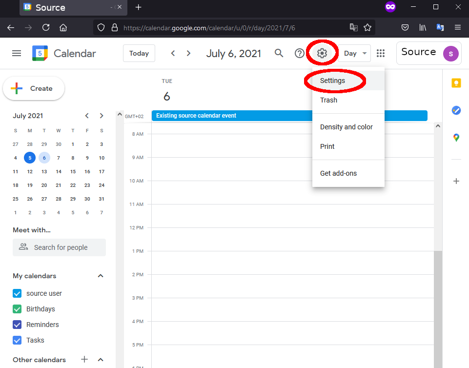
1. Click Import & Export  
    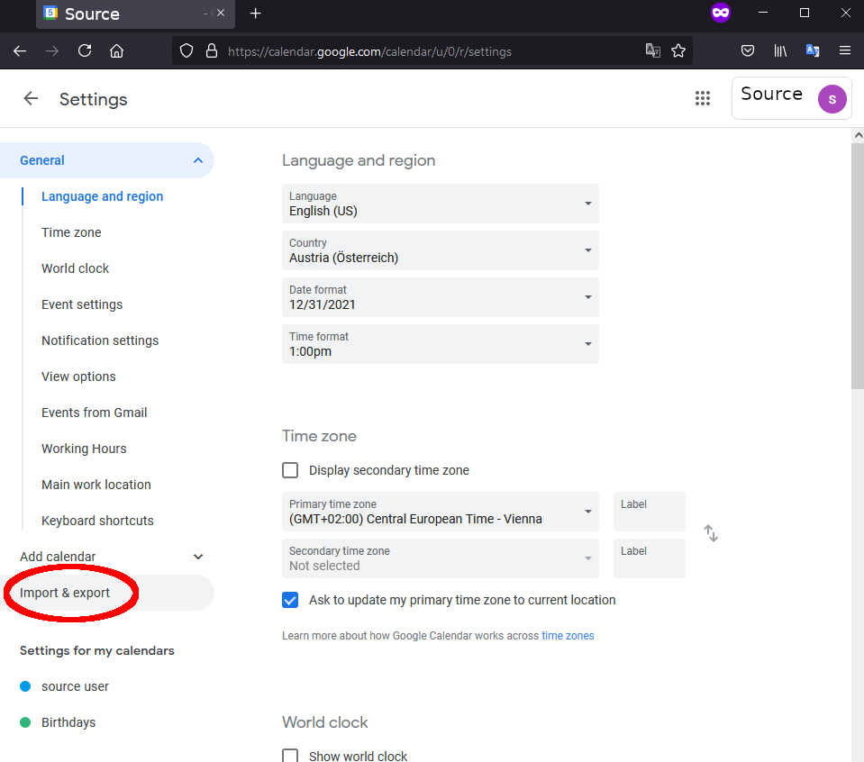
1. Click Export and Save File
    * By default the file should be saved to **Downloads** folder.  
    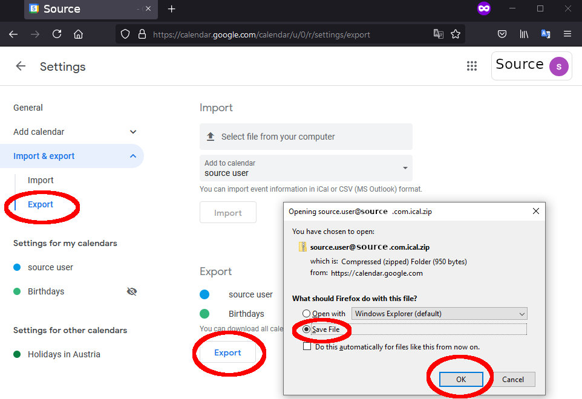
1. Go to the folder where the file was saved and extract the Zip file.  
    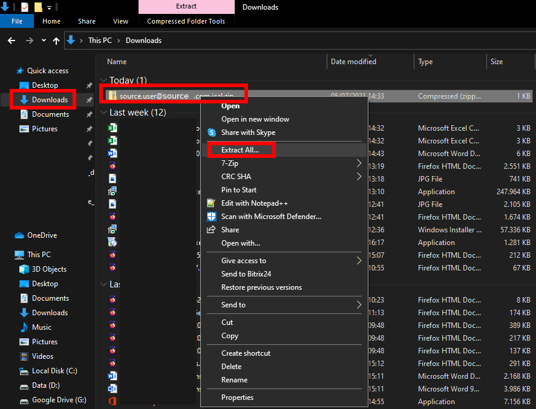
    * By default the file is extracted as a new folder besides the original Zip file.  
        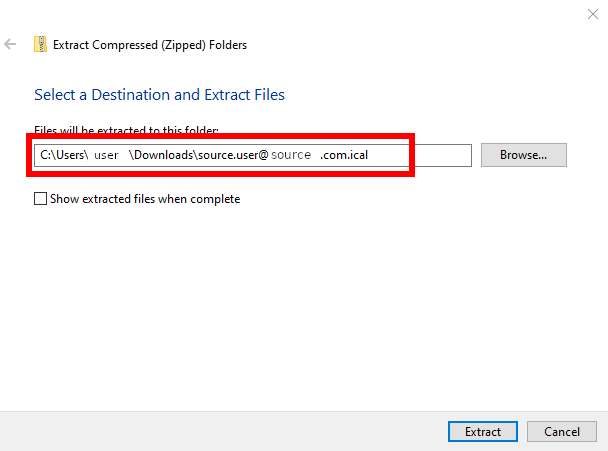
    * There should be now your personal calendar (and any other calendars).  
        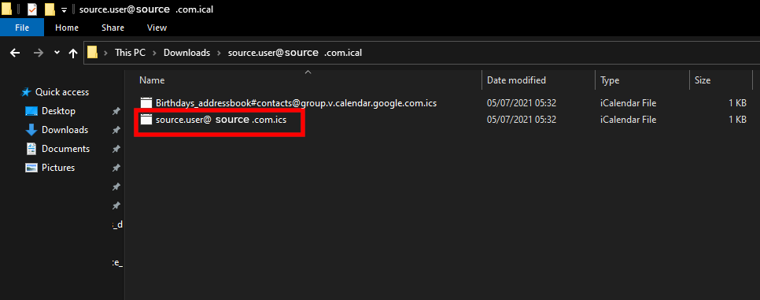

## On DESTINATION user, import calendar
1. Login into https://gmail.com with the destination user and open settings.  
    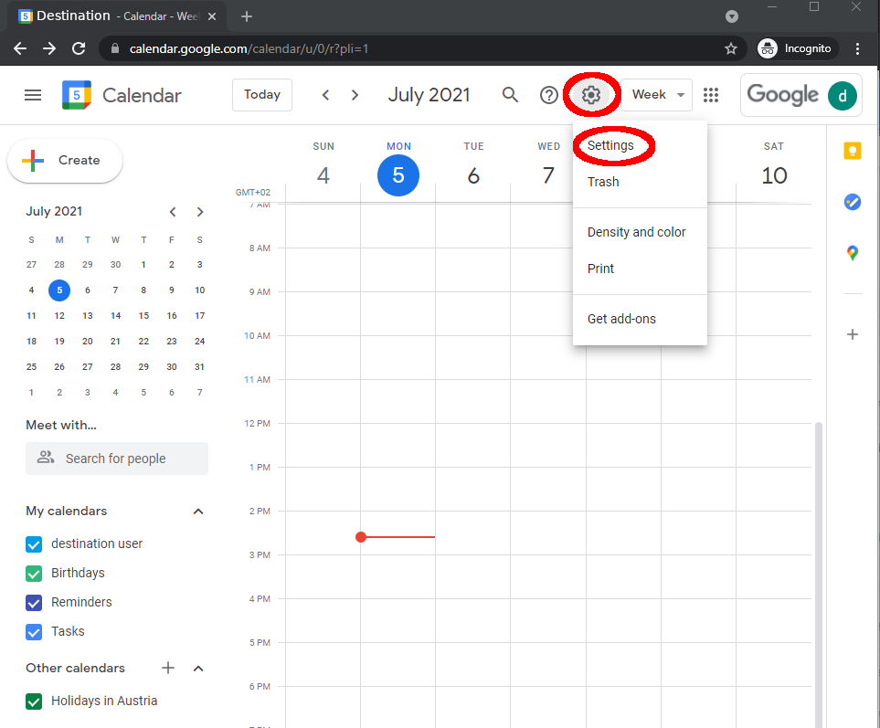
1. Click Import & Export  
    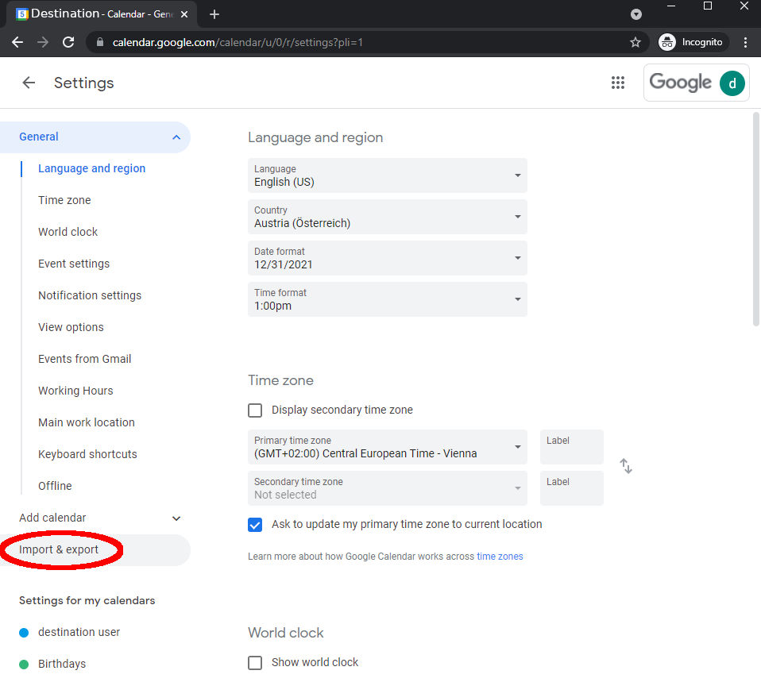
1. Click **Select file from your computer** and select your personal calendar  
    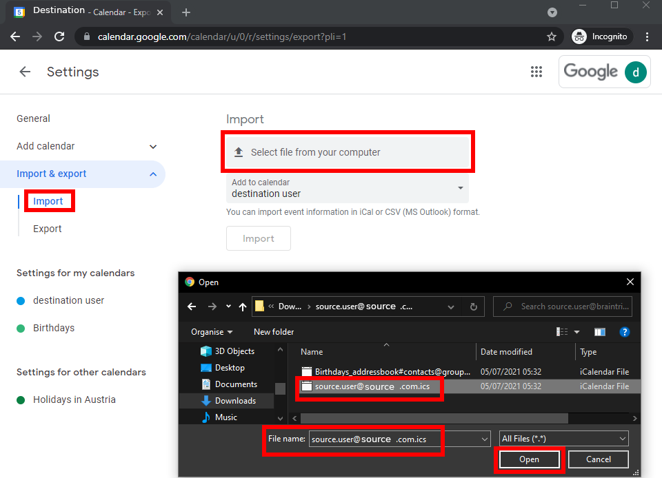
1. Click Import  
    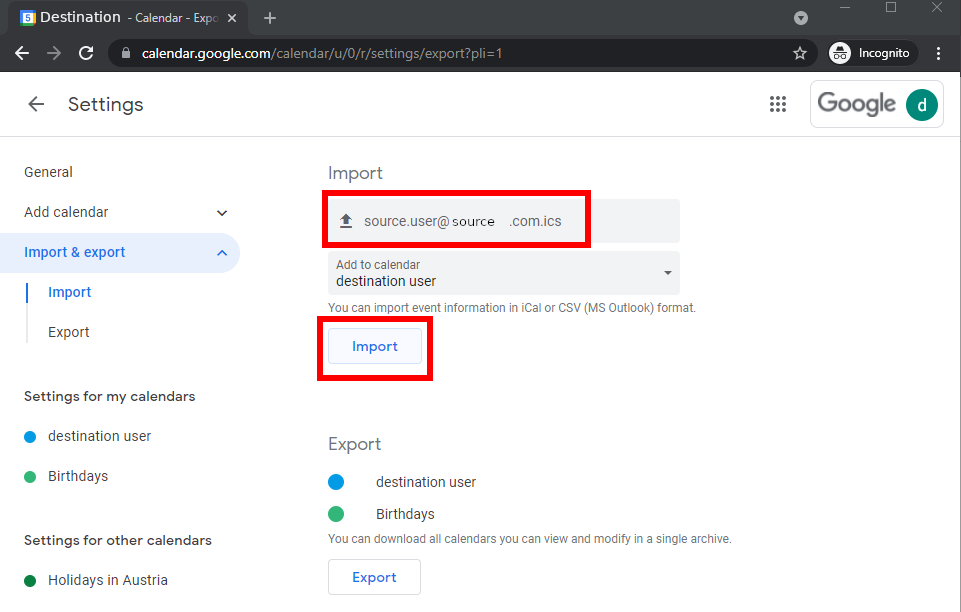
1. There should be notification of imported events  
    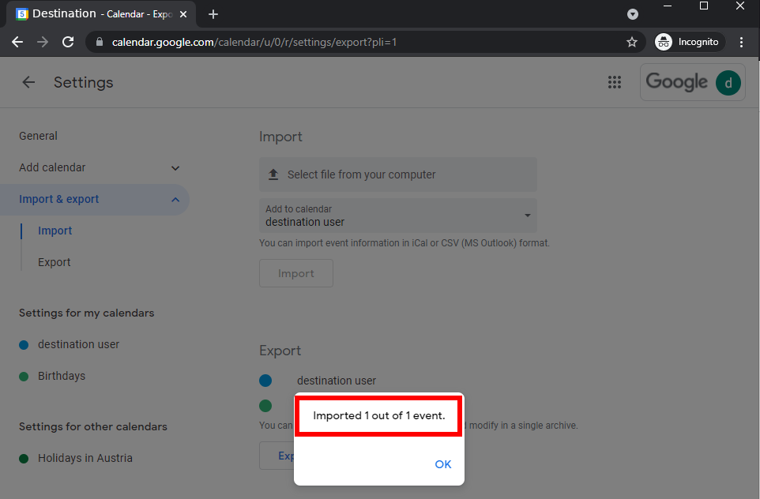
1. Events should show up in the destination user's calendar
    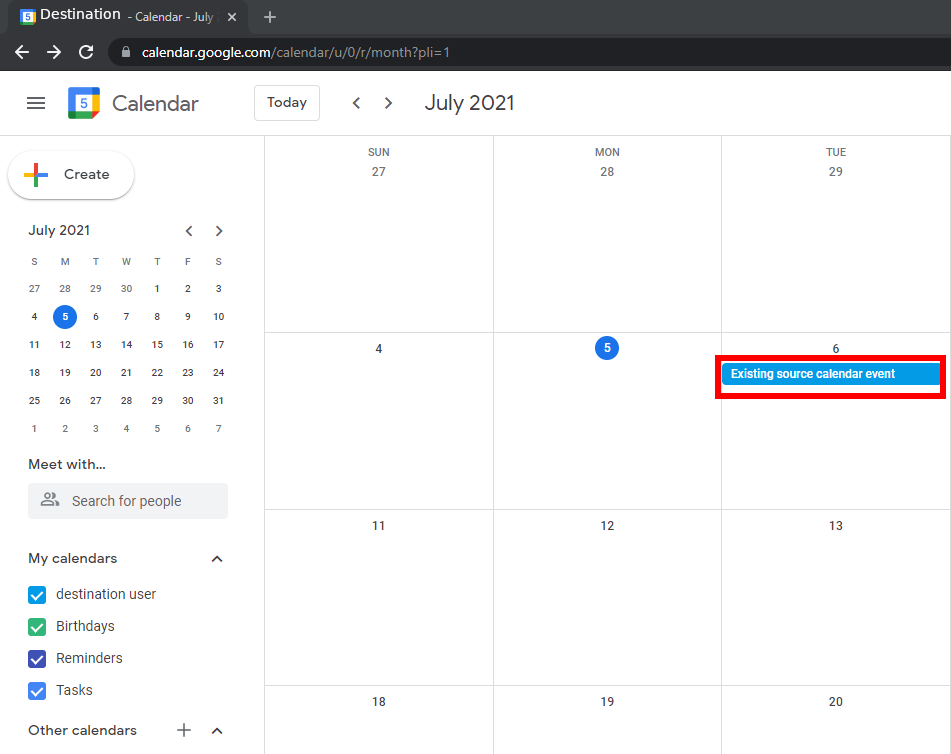

## Automatically decline meetings
* Additionally one can create an automatic decliner for the source user for new
  meetings and add a message to invite the destination user instead.  
    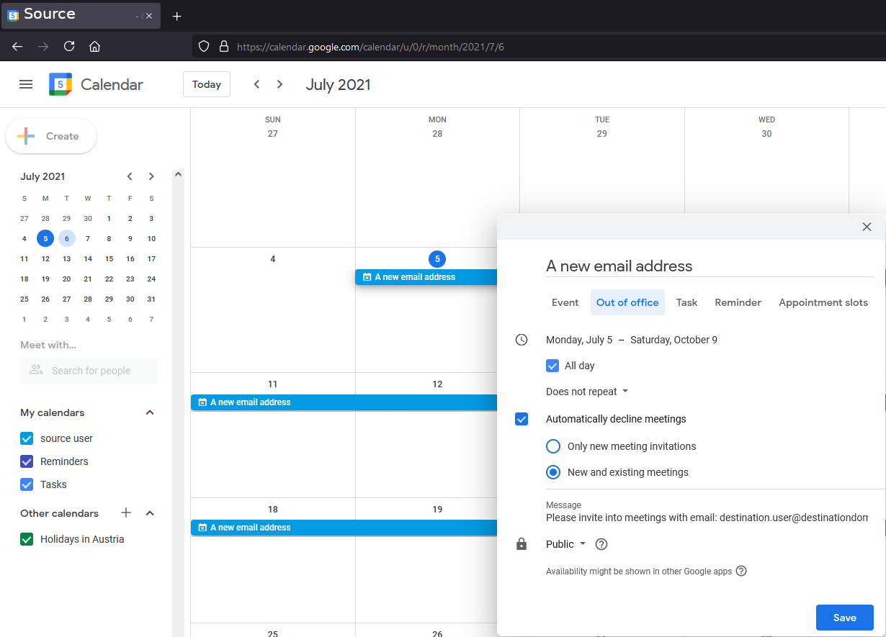
