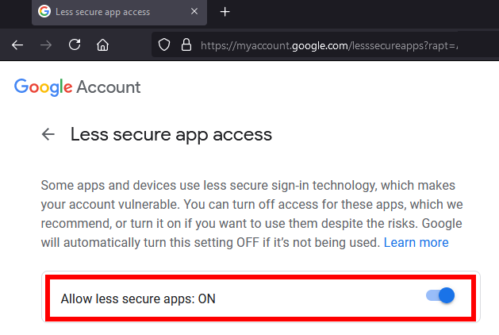
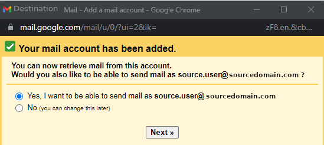

# Migrating emails from Google account to another Google account

* Google Workspace account source.user@sourcedomain.com was migrated to another Google Workspace account destination.user@destinationdomain.com
* Source 1: Check emails from other accounts
  * https://support.google.com/mail/answer/21289?co=GENIE.Platform%3DDesktop&hl=en
* Source 2: Read Gmail messages on other email clients using POP
  * https://support.google.com/mail/answer/7104828?hl=en

## Migrating emails
### SOURCE user source.user@sourcedomain.com
1. Login into https://gmail.com with the source user and open settings.  
    
1. Settings -> Forwading and POP/IMAP
    * **Enable POP for all mail**, check that keep copy is selected.  
            
1. Go to Google Account Security https://myaccount.google.com/security
    * There should be section to enable **Less secure app access**. If one is using 2FA, an App password needs to be created.  
        
    * The feature needs to be enabled by Google Workspace admin in https://admin.google.com/ac/security/lsa before the section shows for the email user.
    * Enable **Less secure app access**  
          
### DESTINATION user destination.user@destinationdomain.com
1. Login with another broser window or incognito with the destination user and
   open settings.  
    
1. **Accounts** -> **Check mail from other accounts**, Add a mail account  
    
1. Add source user  
    
1. Configure settings
    * Settings:
      ~~~
      Email address: source.user@sourcedomain.com
      Username: source.user@sourcedomain.com
      Password: xxx
      POP Server: pop.gmail.com
      Port: 995

      Uncheck, Leave a copy of retrieved message on the server. If checked, there's error "pop.gmail.com does not support leaving messages on the server".
      Check, Always use a secure connection (SSL) when retrieving mail.
      Check, Label incoming messages: <whatever one chooses>
      Uncheck, Archive incoming messages (Skip the Inbox)
      ~~~  
        
    * There will be a question if you want to be able to send as *source.user@sourcedomain.com*. You can select no, if you don't need to send emails via the source user.  
        
    1. **(Send emails as)**: If you selected, YES, for sending emails:
        * Add sender name.
        * Select Treat as an alias.  
        
    1. **(Send emails as)**: Configure source SMTP server settings
        * Google's SMTP server: smtp.gmail.com
        * Port (TLS): 587
        * Check: Secured connection using TLS  
        
    1. **(Send emails as)**: Check your email for verification code and copy-paste it into the input
       field.  
        
        * The verification code email looks like this  
            
1. Everything should be ready, check the **Gmail Settings** -> **Accounts**.
    * **Check mail from the other accounts** should show something like:
        * Checking emails...
        * OR
        * Last checked: 2 minutes ago. No mails fetched. View history Check mail now  
        
            * Of course if the **Send email as** wasn't configured, there's no change from before.
1. Emails from the source user should show up in destination user with defined
   label..  
    
